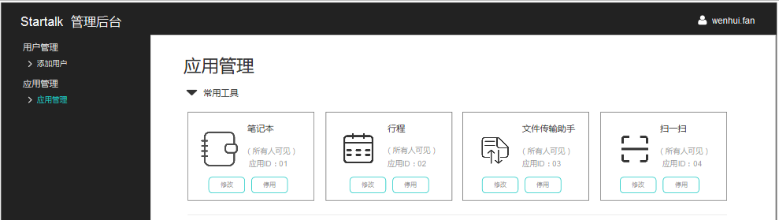
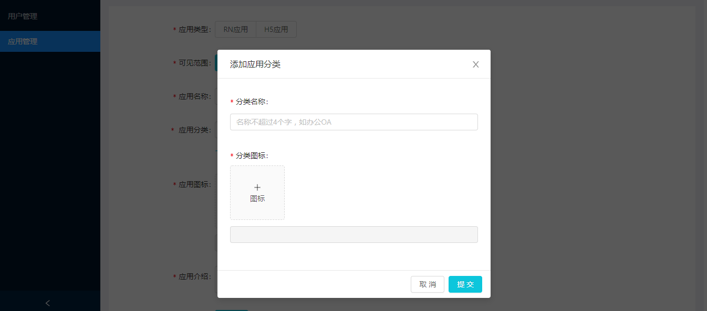
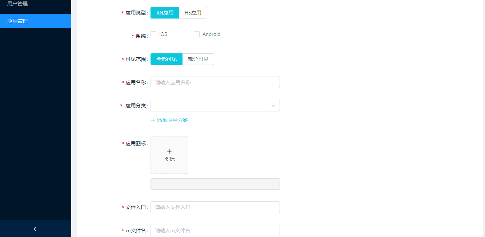
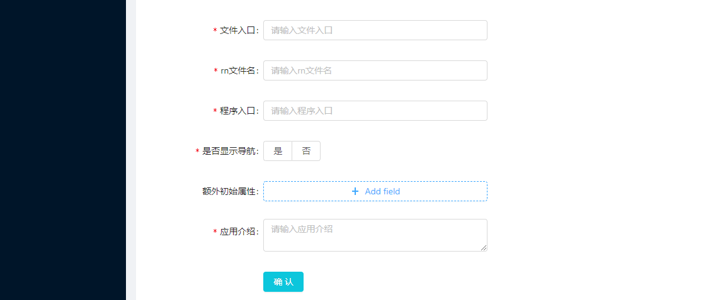
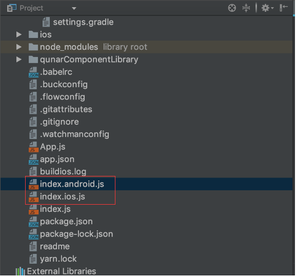
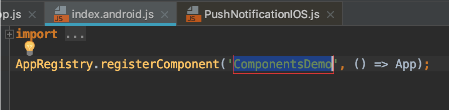
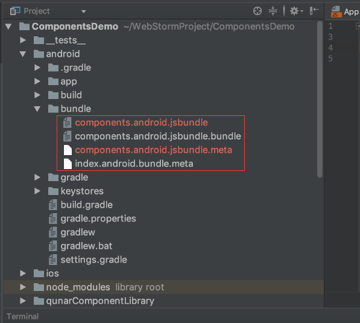
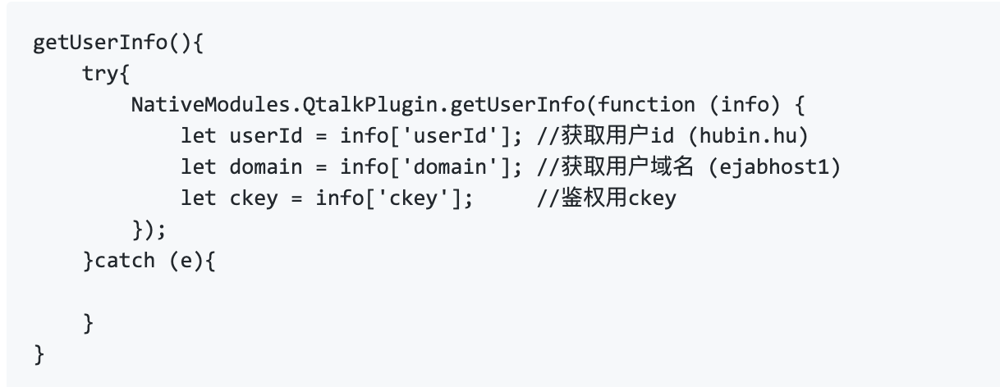

# 如何在startalk内集成自己的应用

Startalk支持用户进行二次扩展，在APP内集成自己的应用，满足企业定制化需求。
[专业版](https://im.qunar.com)提供应用上传的后台，部署完成后，您可通过后台配置的方式嵌入自己的应用，目前支持RN应用及H5应用。

## 接入步骤
### 步骤一：部署后端及前端源码
应用集成目前属于Startalk专业版功能，[查看专业版](https://im.qunar.com)

### 步骤二：管理后台上传应用
1、默认应用

Startalk默认给用户展示4个常用工具，分别为：笔记本、行程、文件传输助手、扫一扫；默认应用支持修改图标及应用名，如不需要，可选择“禁用”，被禁用的应用不展示在客户端

2、自定义应用

2.1 添加自建应用
-   进入后台，应用管理——自定义应用模块，有添加自建应用入口，点击进入添加页面
-   应用类型：您需要先确认所传的应用类型，RN or H5，不同的类型需要上传的内容略有不同
-   可见范围：选择该应用的可见范围，“全部可见”表示该应用全员可用；如选择“部分可见”，请勾选可见的组织架构，组织架构最小单位为部门，无法选择某个人
-   应用名称：为您的应用起个名字，字数限制为2-6字符
-   应用分类：该分类是用户自建的，点击“添加应用分类”可添加，如HR应用、效率工具。分类名称会展示在客户端，作为模块区分的标题
-   应用图标：上传应用图标，JPEG及PNG格式均可，图片限制不能超过512KB
-   应用介绍：简单描述该应用的功能，字数限制为10-200字，应用介绍为非必填选项 

2.2 添加应用分类
-   每个应用都需要归属于某一个分类，在创建应用前，请先创建一个应用分类
-   后续会支持分类排序，用户可根据分类的重要程度决定展示顺序

2.3 RN应用

-   RN应用只支持移动端（iOS及安卓），不支持PC端
-   文件入口：如下图所示，将文件中红框内的Android名配进输入框

-   RN文件名：如下图所示，将红框内内容配置进RN文件名

-   程序入口：如下图所示，将红框内内容配置进程序入口

-   是否显示导航：该选项主要控制进入程序内，是否要显示APP导航

2.4 H5应用

-   系统：选择H5应用后，需要勾选对应上传的系统，才会展示该系统URL上传选项
-   跳转URL：上传URL地址，在客户端点击该应用后，会跳转至URL所在的网页
-   关于鉴权：H5应用采用种cookie的方式传递ckey(只会在本域名下的地址种),后续操作与api文档说明-RN API文档地址应用第7条说明相同

### 步骤三：重启客户端，应用生效
后台修改或新建应用后，客户端需重启后才能生效

## api文档说明
-   [RN API文档地址](https://github.com/qunarcorp/qimrn/wiki/React-Native-EasyComPonents)
-   如何获取鉴权信息
参考上条[RN API文档地址](https://github.com/qunarcorp/qimrn/wiki/React-Native-EasyComPonents)中原生数据接口1,获取基础用户信息.获取到CKEY信息后,从服务器端发起去Startalk服务端接口进行验证.

-   后端提供鉴权能力接口
进入[服务端接口参考](https://github.com/Bin0524/im_http_service_open/blob/master/doc/http_introduction.md),查看第14项:ckey接口验证

